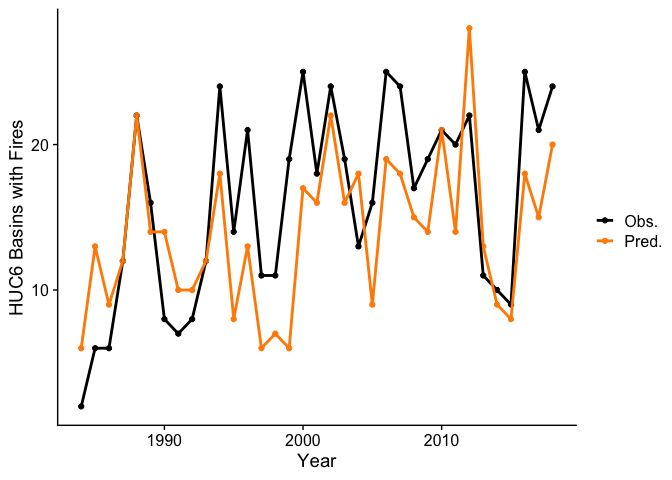

Random Forest Classification of IMW Wildfire
================
Keith Jennings
2021-03-08

First, let’s load the packages we need:

``` r
library(tidymodels)
library(tidyverse)
library(cowplot); theme_set(theme_cowplot())
library(doMC); registerDoMC(cores = 4) # for parallel model fitting & tuning
library(vip) # variable importance plots
library(rgdal)
library(sp)
library(leaflet)
# also need raster, but call the package in line to prevent loss of tidyverse functionality
```

Next, load the data

``` r
data_dir = "../data/wildfire/"
df <- readRDS(paste0(data_dir, "all_data.RDS")) %>% ungroup() 
```

Select a few variables for the model. Future runs will include more, but
testing is quicker this
way.

``` r
df <- select(df, year, huc10, FracBurnedArea, summer_pr, summer_tmmx, summer_pet,
             summer_erc, summer_bi, summer_fm1000) 
```

Do a quick summary by HUC6 to balance fires and no-fires.

``` r
# Add a huc 6 column based on the HUC10 code
df <- df %>% 
  mutate(huc6 = str_sub(huc10, 1, 6))

# Summarize by huc6 and add a fire presence/absence column
df <- select(df, -huc10) %>% 
  group_by(huc6, year) %>% 
  summarize_all(.funs = mean) %>% 
  ungroup %>% 
  mutate(fire = as.factor(ifelse(FracBurnedArea > 0,
                                 "yes", "no"))) %>% 
  na.omit()  # There is a step_naomit, but it breaks the model fit when there are 
             # too many missing values in the analysis/assessment sets
```

Split the data into training and testing

``` r
# Set seed so that the analysis is reproducible
set.seed(6547)

# Split the data into training and testing
df_split <- initial_split(data = df,
                          prop = 0.75,  # This is the proportion of data allocated to training
                          strata = "fire")  # Stratify the sampling based on this variable

# Make new data frames of the training and testing data
df_train <- training(df_split)
df_test <- testing(df_split)
```

Make a recipe for the data

``` r
df_recipe <- recipe(fire ~ ., data = df_train) %>%
  update_role(year, FracBurnedArea, huc6, new_role = "analysis")
```

Split the data into folds for cross-validation

``` r
df_folds <- vfold_cv(df_train, v = 10)
```

Define the random forest model

``` r
rf_mod <- rand_forest() %>% 
  set_engine("ranger", importance = "impurity") %>% 
  set_mode("classification") %>% 
  set_args(mtry = tune(),
           trees = tune())
```

Make a workflow

``` r
rf_flow <- 
  workflow() %>%
  add_model(rf_mod) %>%
  add_recipe(df_recipe)
```

Specify which values to tune in a grid

``` r
rf_grid <- expand.grid(mtry = c(3, 4, 5), 
                       trees = c(100, 300, 500))
```

Run the tuning grid

``` r
rf_tune_results <- rf_flow %>%
  tune_grid(resamples = df_folds, #CV object
            grid = rf_grid, # grid of values to try
            metrics = metric_set(accuracy, roc_auc) # metrics we care about
  )
```

    ## 
    ## Attaching package: 'rlang'

    ## The following objects are masked from 'package:purrr':
    ## 
    ##     %@%, as_function, flatten, flatten_chr, flatten_dbl, flatten_int,
    ##     flatten_lgl, flatten_raw, invoke, list_along, modify, prepend,
    ##     splice

    ## 
    ## Attaching package: 'vctrs'

    ## The following object is masked from 'package:tibble':
    ## 
    ##     data_frame

    ## The following object is masked from 'package:dplyr':
    ## 
    ##     data_frame

Print results

``` r
rf_tune_results %>%
  collect_metrics() %>% 
  knitr::kable()
```

| mtry | trees | .metric  | .estimator |      mean |  n |  std\_err | .config               |
| ---: | ----: | :------- | :--------- | --------: | -: | --------: | :-------------------- |
|    3 |   100 | accuracy | binary     | 0.6935877 | 10 | 0.0102946 | Preprocessor1\_Model1 |
|    3 |   100 | roc\_auc | binary     | 0.7346829 | 10 | 0.0113349 | Preprocessor1\_Model1 |
|    4 |   100 | accuracy | binary     | 0.6815421 | 10 | 0.0082261 | Preprocessor1\_Model2 |
|    4 |   100 | roc\_auc | binary     | 0.7309597 | 10 | 0.0118467 | Preprocessor1\_Model2 |
|    5 |   100 | accuracy | binary     | 0.6805469 | 10 | 0.0085076 | Preprocessor1\_Model3 |
|    5 |   100 | roc\_auc | binary     | 0.7299910 | 10 | 0.0128407 | Preprocessor1\_Model3 |
|    3 |   300 | accuracy | binary     | 0.6871149 | 10 | 0.0069455 | Preprocessor1\_Model4 |
|    3 |   300 | roc\_auc | binary     | 0.7331933 | 10 | 0.0113848 | Preprocessor1\_Model4 |
|    4 |   300 | accuracy | binary     | 0.6898754 | 10 | 0.0088727 | Preprocessor1\_Model5 |
|    4 |   300 | roc\_auc | binary     | 0.7352359 | 10 | 0.0123331 | Preprocessor1\_Model5 |
|    5 |   300 | accuracy | binary     | 0.6871063 | 10 | 0.0081428 | Preprocessor1\_Model6 |
|    5 |   300 | roc\_auc | binary     | 0.7361898 | 10 | 0.0134279 | Preprocessor1\_Model6 |
|    3 |   500 | accuracy | binary     | 0.6917359 | 10 | 0.0100448 | Preprocessor1\_Model7 |
|    3 |   500 | roc\_auc | binary     | 0.7336719 | 10 | 0.0128722 | Preprocessor1\_Model7 |
|    4 |   500 | accuracy | binary     | 0.6861371 | 10 | 0.0065984 | Preprocessor1\_Model8 |
|    4 |   500 | roc\_auc | binary     | 0.7342937 | 10 | 0.0138176 | Preprocessor1\_Model8 |
|    5 |   500 | accuracy | binary     | 0.6833506 | 10 | 0.0085605 | Preprocessor1\_Model9 |
|    5 |   500 | roc\_auc | binary     | 0.7361148 | 10 | 0.0130752 | Preprocessor1\_Model9 |

Extract the best model parameters and add to workflow

``` r
param_best <- rf_tune_results %>% 
  select_best(metric = "accuracy") # can also choose "roc_auc"

rf_flow_tuned <- rf_flow %>% 
  finalize_workflow(param_best)
```

Evaluate the model by fitting to training and analyzing test

``` r
rf_fit <- rf_flow_tuned %>%
  # fit on the training set and evaluate on test set
  last_fit(df_split)
```

Examine the model metrics

``` r
rf_fit %>% collect_metrics() %>% 
  knitr::kable()
```

| .metric  | .estimator | .estimate | .config               |
| :------- | :--------- | --------: | :-------------------- |
| accuracy | binary     | 0.6703911 | Preprocessor1\_Model1 |
| roc\_auc | binary     | 0.7213139 | Preprocessor1\_Model1 |

``` r
# Create a confusion matrix
rf_fit %>% collect_predictions() %>% 
  conf_mat(truth = fire, estimate = .pred_class) %>% 
  autoplot(type = "heatmap")
```

<!-- -->

To create the final version of the model, run the fit on the full
dataset. We will use this model to make future predictions.

``` r
final_model <- rf_flow_tuned %>% 
  fit(df)
```

Extract the final fitted data

``` r
# This will be used for analysis, plotting, etc.
final_fit <- final_model %>% pull_workflow_fit()

# Add the predictions to the data
df_preds <- df %>% 
  mutate(pred_yes = final_fit$fit$predictions[,2],
         fire_pred = ifelse(pred_yes > 0.5, "yes", "no") %>% as.factor())
```

Make some plots

``` r
# Plot predicted fire / no fire by year
ggplot(df_preds, aes(year, fill = fire_pred)) +
  geom_bar(position = "dodge")
```

<!-- -->

``` r
# Plot obs vs. sim fires
df_preds %>% 
  group_by(year) %>% 
  summarise(obs = sum(fire == "yes", na.rm = T),
            sim = sum(fire_pred == "yes", na.rm = T)) %>% 
  ggplot(aes(obs, sim)) +
  geom_point() +
  geom_abline(slope = 1, intercept = 0)
```

    ## `summarise()` ungrouping output (override with `.groups` argument)

<!-- -->

``` r
# Plot obs vs. sim fires by year
df_preds %>% 
  group_by(year) %>% 
  summarise(obs = sum(fire == "yes"),
            sim = sum(fire_pred == "yes")) %>% 
  pivot_longer(cols = c(obs, sim), names_to = "cat", values_to = "n_fires") %>% 
  ggplot(aes(year, n_fires, color = cat)) +
  geom_point() +
  geom_line(lwd = 1) +
  labs(x = "Year", y = "HUC6 Basins with Fires") +
  scale_color_manual(values = c("black", "darkorange"),
                     labels = c("Obs.", "Pred."), 
                     name = "")
```

    ## `summarise()` ungrouping output (override with `.groups` argument)

<!-- -->

Add HUC06 boundaries to map out 2012 fire occurrence (commented out
below because file was too large)

``` r
# Import HUC06 map
# basins <- readOGR(dsn = "../data/wildfire/", layer = "huc06_basins")
# 
# # Create an extent object for cropping basins
# analysis_extent <- raster::extent(-115.429, -100.677,
#                                   29.83, 46.4)
# 
# # Crop by extent 
# basins_cropped <- raster::crop(basins, analysis_extent)
# 
# # Join 2012 wildfire data for viz
# basins_2012 <- sp::merge(basins_cropped,
#                          filter(df_preds, year == 2012) %>% select(HUC6 = huc6, fire_pred),
#                          by = "HUC6")

# Make a color ramp for the map using viridis
#map_pal <- colorFactor("magma", basins_2012$fire_pred)

# Make interactive map with leaflet
# leaflet(basins_2012) %>% #make leaflet object with test2 data
#   addTiles() %>% #add a basemap (default = open street map)
#   addPolygons(popup = paste0(basins_2012$HUC6, "<br>", 
#                              basins_2012$fire_pred), #popup county name and ead on click
#               fillColor = ~map_pal(fire_pred), #fill with palette
#               color = "black", #black outlines for counties
#               fillOpacity = 0.6) %>% #semi-opaque fill
#   addLegend(position = "bottomright", #add legend to bottom right
#             pal = map_pal, #use color palette for legend
#             values = ~fire_pred, #values are ead
#             title = "Fire Predicted")
```
