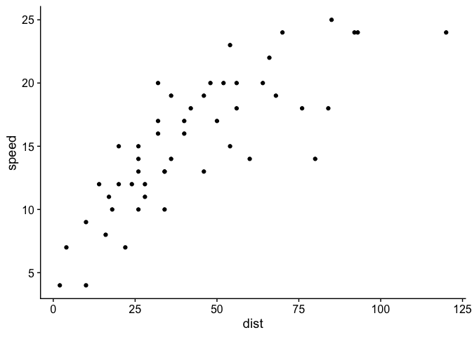

Machine Learning with Random Forest Models and the Tidymodels
================
Keith Jennings

## Why tidymodels?

Much like how the tidyverse is a group of packages for exploring,
modifying, and plotting data, tidymodels provides a unified framework
for statistical modeling in R. Its function-based approach allows for
intuitive model set up while also letting the user make any necessary
edits without changing the entire script.

## Why random forest models?

Random forest is a machine learning approach where the models learn
patterns from the data to make outcome predictions. It is a form of
supervised regression that can be easily run numerous times.

Assumptions + simplicity.

## Model setup

### Packages and data

A key part to any machine learning effort is the proper set up,
training, and testing of the included models. `tidymodels` makes this
process straightforward and reproducible. Conveniently, many of the same
bits of code can be used, even when the model engine or type changes.

First, let’s load the packages we need:

``` r
library(tidyverse)
library(tidymodels)
library(cowplot); theme_set(theme_cowplot()) # I like the cowplot because it makes plot pretty
```

Next, we’ll need to load some data:

``` r
df <- readRDS("data/thermal_sensitivity.RDS")
```

Look at the
data

``` r
head(df) %>% knitr::kable()
```

|        lon |      lat | SITE\_NO | str\_order |    so | man\_n |    width | elev\_pt | tailwater | canopy\_pct |     slope |    ppt | drain\_area | nlcd11\_pct | bfi |   scf\_av | elev\_av | elev\_max | basin\_sto | quartile\_1k | quartile\_10k | quartile\_100k | lat\_lon\_temp  | lm\_type            | therm\_sens |
| ---------: | -------: | :------- | ---------: | ----: | -----: | -------: | -------: | --------: | ----------: | --------: | -----: | ----------: | ----------: | --: | --------: | -------: | --------: | ---------: | -----------: | ------------: | -------------: | :-------------- | :------------------ | ----------: |
| \-106.5220 | 37.40251 | 08235250 |          3 | 0.020 |  0.055 |  4.95973 |  2890.93 |         0 |       15.77 | 0.0197100 | 833.21 |       97.90 |    0.092854 |  63 | 0.4770940 | 3396.714 |      3554 |          0 |            5 |             5 |              5 | 37.403,-106.522 | estimate\_max\_tair |   0.5443044 |
| \-106.4507 | 37.40269 | 08235700 |          3 | 0.006 |  0.055 |  7.05333 |  2753.51 |         0 |       13.57 | 0.0056958 | 739.43 |      200.59 |    0.159284 |  64 | 0.4371842 | 3378.867 |      3554 |          0 |            5 |             5 |              5 | 37.403,-106.451 | estimate\_max\_tair |   0.5450876 |
| \-106.3348 | 37.37473 | 08236000 |          3 | 0.008 |  0.055 |  7.93961 |  2645.79 |         0 |       42.48 | 0.0075676 | 606.02 |      282.74 |    0.226636 |  65 | 0.3865836 | 3320.905 |      3554 |          0 |            5 |             5 |              5 | 37.375,-106.335 | estimate\_max\_tair |   0.5729804 |
| \-106.2777 | 37.35271 | 08236500 |          3 | 0.018 |  0.055 |  7.98772 |  2582.64 |         0 |       31.74 | 0.0178122 | 414.66 |      297.19 |    0.416708 |  63 | 0.3739393 | 3274.174 |      3554 |      15182 |            1 |             1 |              5 | 37.353,-106.278 | estimate\_max\_tair |   0.4461660 |
| \-107.6676 | 37.79027 | 09359020 |          4 | 0.008 |  0.055 | 10.47100 |  2815.10 |         0 |        1.12 | 0.0080230 | 894.42 |      384.56 |    0.220458 |  66 | 0.5467742 | 3538.300 |      3765 |        504 |            5 |             5 |              5 | 37.79,-107.668  | estimate\_max\_tair |   0.6704268 |
| \-106.3737 | 40.24063 | 09041100 |          2 | 0.021 |  0.060 |  2.10000 |  2432.55 |         0 |        0.00 | 0.0213539 | 422.75 |       35.04 |    0.000000 |  64 | 0.3898872 | 2742.667 |      2986 |          0 |            5 |             5 |              5 | 40.241,-106.374 | estimate\_max\_tair |   0.2924559 |

There are a few columns we won’t need in our analysis, so we’ll keep
only the ones we need using the `select()` function.

``` r
df <- df %>% 
  select(str_order:basin_sto, therm_sens) %>% 
  ungroup()
```

### Prep the data

The first thing you need to do is split the data into *training* and
*testing* sets. We’ll use the former to optimize the random forest
models and the latter to independently test their efficacy. Here, we’ll
use functions from the `rsample` package within `tidymodels`.

``` r
# Set seed so that the analysis is reproducible
set.seed(6547)

# Split the data into training and testing
df_split <- initial_split(data = df,
                          prop = 0.75,  # This is the proportion of data allocated to training
                          strata = "therm_sens")  # Stratify the sampling based on this variable

# Make new data frames of the training and testing data
df_train <- training(df_split)
df_test <- testing(df_split)
```

### Define the model

The `parsnip` package in `tidymodels` lets us choose from a wide variety
of models. You can view them all
[here](https://www.tidymodels.org/find/parsnip/). We’re going to use
`rand_forest()` to create a random forest model.

``` r
rf_mod <- rand_forest(mtry = 3, trees = 500) %>% 
  set_engine("randomForest") %>% 
  set_mode("regression")
```

You might now be thinking we could run the random forest now on the
`df_train` and test it on `df_test`. Au contraire, using a single split
between training and testing means all your inferences on model
performance are a result of how the model fits that specific division.
Instead, we’ll split our training data split into several subsplits
called folds through a process called k-fold (or v-fold)
cross-validation. In each fold, a split occurs between analysis and
assesment data (Kuhn and Johnson, 2019). The random forest model is
first optimized on the analysis data and tested on the assessment data.

``` r
df_folds <- vfold_cv(df_train, v = 10)
```

### Make a workflow

Conveniently, `tidymodels` includes a workflow package that allows us to
set up a reusable function for each model.

``` r
rf_flow <- 
  workflow() %>%
  add_model(rf_mod) %>%
  add_formula(therm_sens ~ .)
```

## Run the model

### Run the cross-validation on analysis and assessment data

Once we have the workflow defined, we can run the cross-validation
routine.

``` r
rf_fit <- 
  rf_flow %>% 
  fit_resamples(df_folds)
```

### Examine model metrics

``` r
rf_metrics <- collect_metrics(rf_fit)
knitr::kable(rf_metrics)
```

| .metric | .estimator |      mean |  n |  std\_err | .config               |
| :------ | :--------- | --------: | -: | --------: | :-------------------- |
| rmse    | standard   | 0.1307999 | 10 | 0.0142705 | Preprocessor1\_Model1 |
| rsq     | standard   | 0.2690349 | 10 | 0.0729753 | Preprocessor1\_Model1 |

## What if I don’t have enough data?

Most machine learning methods perform best when run using large
datasets. Random forest, although its simple learning algorithm lends
itself well to smaller datasets, is no exception. For some of our
drought impact data, we may be limited to an extremely small set of
outcomes. Annual skier visits in Colorado, for example, is a time series
of just 23 values. Thus, a simpler approach (i.e., ordinary least
squares regression) is likely advisable. Fortunately, this can all be
done in the `tidymodels` framework with a few changes.

### Define the model

Much as we used the `rand_forest()` function for the random forest
exercise, we can use the `linear_reg()` function for linear regression.

``` r
lm_mod <- linear_reg() %>% 
  set_engine("lm")
```

### But what about??

Manipulating data and preprocessing using `recipe` package and
`step_*()` functions Hyperparameter tuning done in v-fold
cross-validation

## Acknowledgments

This was adapted from the following excellent
    articles:

  - <https://juliasilge.com/blog/intro-tidymodels/>
  - <https://www.brodrigues.co/blog/2018-11-25-tidy_cv/>
  - <https://hansjoerg.me/2020/02/09/tidymodels-for-machine-learning/#tuning-model-parameters-tune-and-dials>

## Including Plots

You can also embed plots, for
example:

``` r
ggplot(cars, aes(dist, speed)) + geom_point()
```

<!-- -->

Note that the `echo = FALSE` parameter was added to the code chunk to
prevent printing of the R code that generated the plot.
